<div align="center">

# INTERACTIVE MEDIA

**입력하는 몸과 반응하는 화면.**<br/>
웹에서 직접 만져보는 인터랙티브 미디어 기법 17가지를 한 페이지에 담았습니다.

### [▶ 라이브 데모 열기](https://kasangyong.github.io/interactive-media/)

[](https://github.com/kasangyong/interactive-media/actions/workflows/deploy.yml)


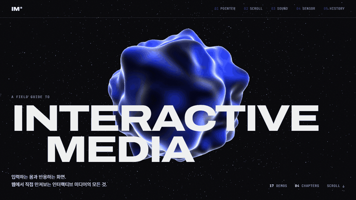

</div>

<br/>

포인터, 스크롤, 소리, 카메라와 센서. 화면을 바꾸는 입력은 생각보다 다양합니다. 이 사이트는 각 기법을 **짧은 설명 + 바로 만져볼 수 있는 데모**로 묶어 위에서 아래로 스크롤하며 체험하도록 만든 인터랙티브 아카이브입니다. 데모는 페이지 안에서 바로 실행되고, 화면 밖으로 나가면 스스로 멈춥니다.

> 💡 **데스크톱 Chrome / Edge 권장.** 사운드 챕터는 헤드폰을 쓰면 더 좋습니다. 카메라·마이크 데모는 버튼을 눌러야만 켜지고, 영상과 소리는 **기기 밖으로 전송되지 않습니다.**

<br/>

## ✦ 하이라이트

<table>
  <tr>
    <td width="50%">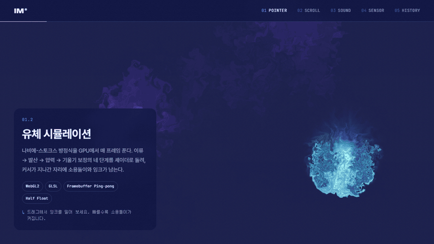</td>
    <td width="50%">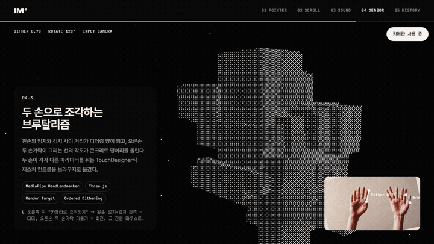</td>
  </tr>
  <tr>
    <td><b>유체 시뮬레이션</b> — 나비에-스토크스 방정식을 GPU 셰이더로 매 프레임 풀어 커서가 지나간 자리에 소용돌이를 남깁니다.</td>
    <td><b>두 손으로 조각하는 브루탈리즘</b> — 왼손 엄지·검지 간격은 디더링, 오른손 손가락 선의 기울기는 회전. MediaPipe가 브라우저 안에서 손 관절 21개를 추적합니다.</td>
  </tr>
  <tr>
    <td>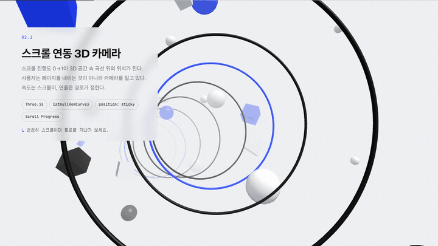</td>
    <td>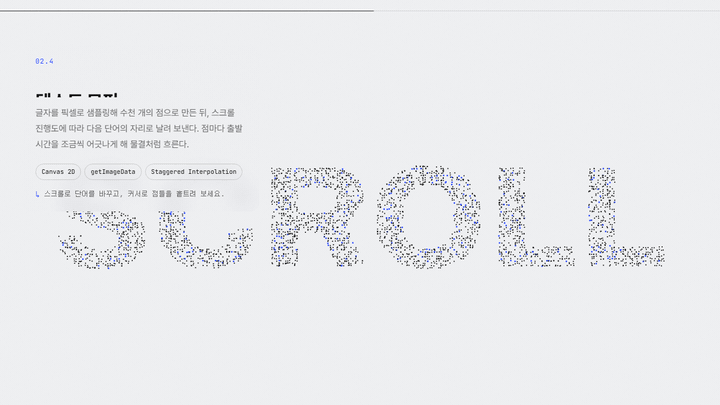</td>
  </tr>
  <tr>
    <td><b>스크롤 연동 3D 카메라</b> — 스크롤 진행도가 곧 곡선 위의 위치. 사용자는 페이지가 아니라 카메라를 밀고 있습니다.</td>
    <td><b>텍스트 모핑</b> — 글자를 4,200개의 점으로 샘플링해 다음 단어 자리로 날려 보냅니다. 점마다 출발이 어긋나 물결처럼 흐릅니다.</td>
  </tr>
  <tr>
    <td colspan="2">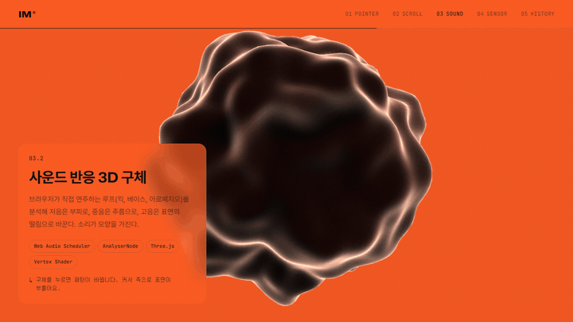</td>
  </tr>
  <tr>
    <td colspan="2"><b>사운드 반응 3D 구체</b> — 브라우저가 직접 연주하는 루프를 FFT로 분석해 저음은 부피로, 중음은 주름으로, 고음은 떨림으로 바꿉니다.</td>
  </tr>
</table>

<br/>

## ✦ 데모 갤러리

각 제목을 누르면 라이브 사이트의 해당 데모로 바로 이동합니다.

### 01 · Pointer & Gesture — 화면 속 세계를 직접 만지는 손

| | 데모 | 무엇을 보여주나 | 핵심 기술 |
|:-:|---|---|---|
| 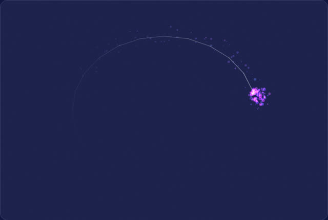 | **[커서 파티클 트레일](https://kasangyong.github.io/interactive-media/#demo-cursor-trail)** | 포인터 속도가 입자의 밀도와 색으로 번역되는 가장 단순한 피드백 루프 | Pointer Events, Canvas 2D, Object Pool |
| 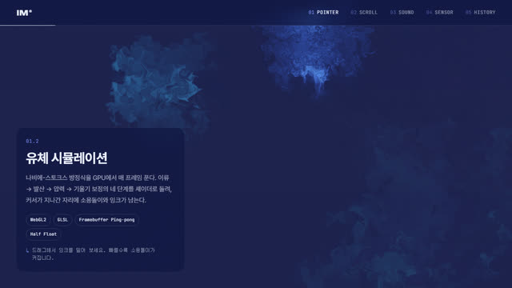 | **[유체 시뮬레이션](https://kasangyong.github.io/interactive-media/#demo-fluid)** | 이류 → 발산 → 압력 → 기울기 보정을 셰이더로 돌리는 Stable Fluids | WebGL2, GLSL, FBO Ping-pong |
| 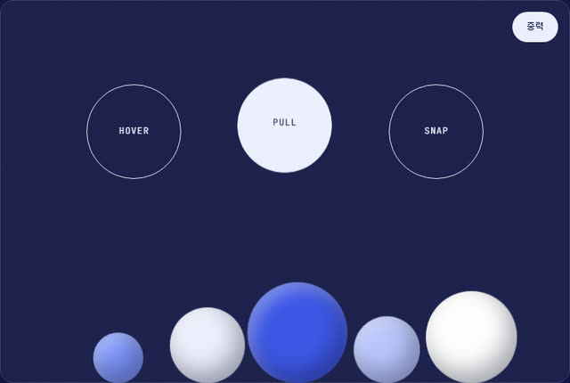 | **[자석 버튼 & 물리 드래그](https://kasangyong.github.io/interactive-media/#demo-magnetic-drag)** | 커서를 향해 끌려오는 버튼, 던진 속도 그대로 튕기는 공 | Pointer Capture, 충돌·탄성 물리 |
| 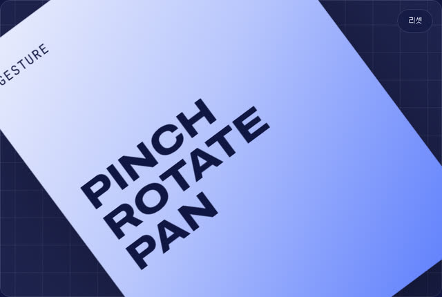 | **[멀티터치 제스처](https://kasangyong.github.io/interactive-media/#demo-multitouch)** | 두 손가락의 거리·각도·중점을 하나의 변환 행렬로 합치는 핀치 줌 | Pointer Events, WheelEvent |

### 02 · Scroll & Motion — 스크롤은 시간 축이다

| | 데모 | 무엇을 보여주나 | 핵심 기술 |
|:-:|---|---|---|
| 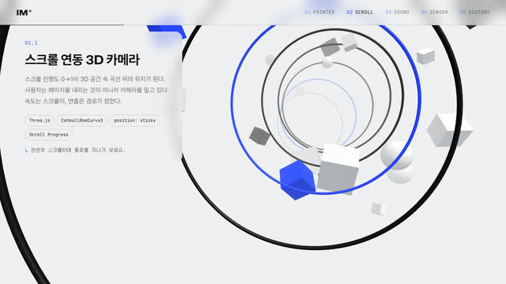 | **[스크롤 연동 3D 카메라](https://kasangyong.github.io/interactive-media/#demo-scroll-camera)** | 진행도 0→1을 CatmullRom 곡선 위의 카메라 위치로 매핑 | Three.js, position: sticky |
| 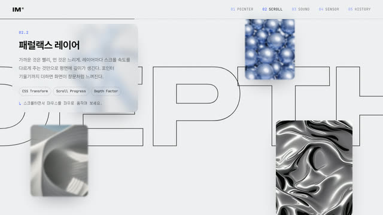 | **[패럴랙스 레이어](https://kasangyong.github.io/interactive-media/#demo-parallax)** | 레이어마다 다른 속도와 포인터 기울기로 만드는 깊이감 | CSS Transform, Depth Factor |
| 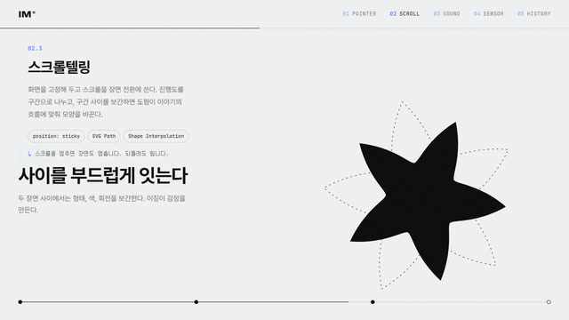 | **[스크롤텔링](https://kasangyong.github.io/interactive-media/#demo-scrollytelling)** | 고정된 화면에서 진행도를 구간으로 나눠 도형과 이야기를 전환 | SVG Path, 극좌표 보간 |
| 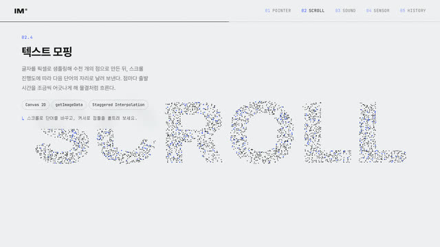 | **[텍스트 모핑](https://kasangyong.github.io/interactive-media/#demo-text-morph)** | 픽셀 샘플링한 점들이 시차를 두고 다음 단어로 이동 | getImageData, Staggered Interpolation |

### 03 · Sound & Audio — 브라우저 안의 모듈러 신시사이저

| | 데모 | 무엇을 보여주나 | 핵심 기술 |
|:-:|---|---|---|
| 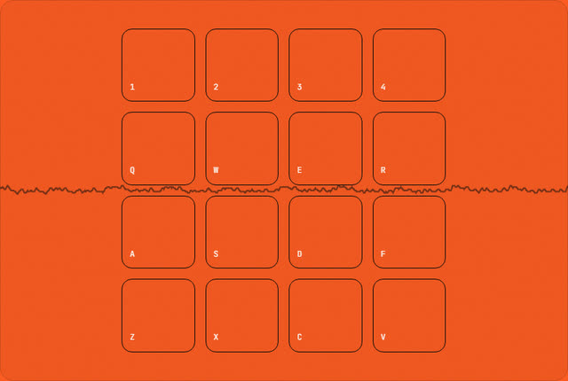 | **[신시사이저 패드](https://kasangyong.github.io/interactive-media/#demo-synth-pad)** | 펜타토닉 4×4 패드. 커서 높이가 필터를 열고 닫음 | OscillatorNode, BiquadFilter, ADSR |
| 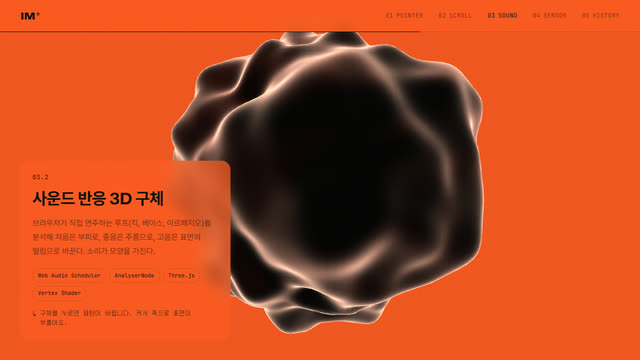 | **[사운드 반응 3D 구체](https://kasangyong.github.io/interactive-media/#demo-audio-sphere)** | 룩어헤드 스케줄러로 연주한 루프를 대역별로 분석해 형태로 | Web Audio Scheduler, Vertex Shader |
| 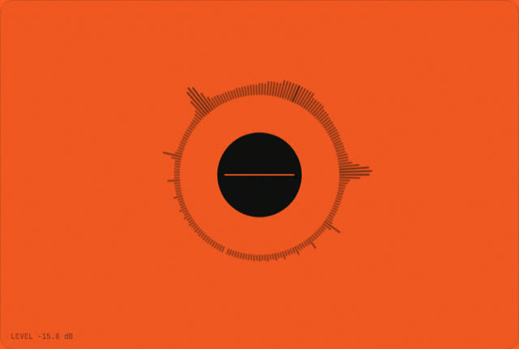 | **[마이크 오디오 비주얼라이저](https://kasangyong.github.io/interactive-media/#demo-mic-visualizer)** | 목소리를 로그 스케일 원형 스펙트럼과 파형으로 | getUserMedia, AnalyserNode |
| 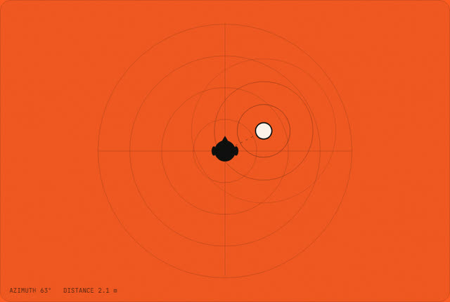 | **[공간 음향](https://kasangyong.github.io/interactive-media/#demo-spatial-audio)** | 위에서 본 평면에서 음원을 옮기면 헤드폰 속 소리도 이동 | PannerNode (HRTF) |

### 04 · Camera, Sensor & Generative — 몸 전체가 입력이 된다

| | 데모 | 무엇을 보여주나 | 핵심 기술 |
|:-:|---|---|---|
| 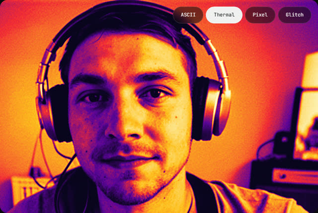 | **[웹캠 셰이더 필터](https://kasangyong.github.io/interactive-media/#demo-webcam-shader)** | 카메라 영상을 아스키 / 열화상 / 픽셀 / 글리치로 재해석 | VideoTexture, Fragment Shader |
| 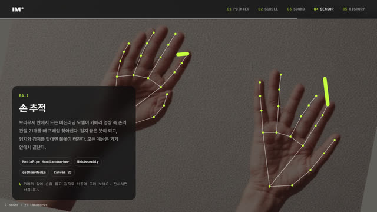 | **[손 추적](https://kasangyong.github.io/interactive-media/#demo-hand-tracking)** | 검지 끝은 붓, 엄지·검지 핀치는 불꽃 | MediaPipe HandLandmarker, WASM |
| 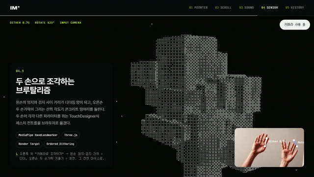 | **[두 손으로 조각하는 브루탈리즘](https://kasangyong.github.io/interactive-media/#demo-hand-brutalism)** | 두 손이 각각 다른 파라미터를 쥐는 TouchDesigner식 제스처 컨트롤 | MediaPipe, Render Target, Bayer Dithering |
| 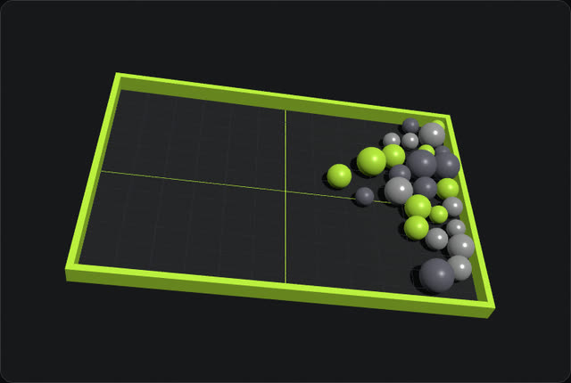 | **[기기 기울기 장면](https://kasangyong.github.io/interactive-media/#demo-gyro-scene)** | 휴대폰을 기울이면 중력이 바뀌는 쟁반 (데스크톱은 커서로) | DeviceOrientationEvent |
| 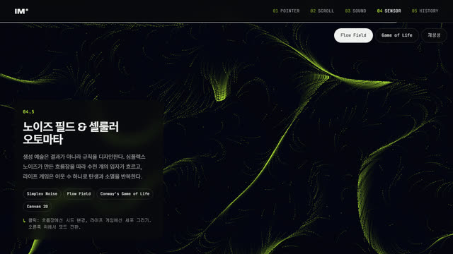 | **[노이즈 필드 & 셀룰러 오토마타](https://kasangyong.github.io/interactive-media/#demo-noise-field)** | 심플렉스 흐름장 위 3,200개 입자 / 라이프 게임 | Simplex Noise, Game of Life |

<p align="center">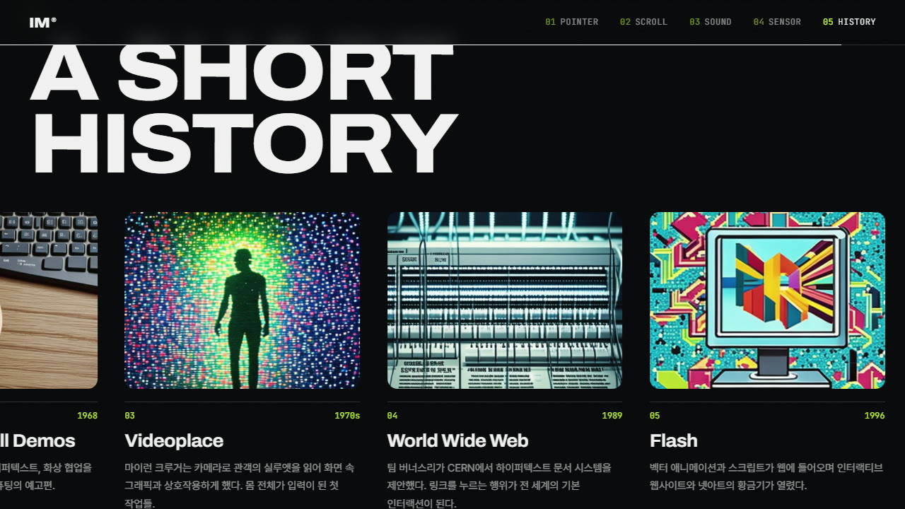</p>
<p align="center"><sub>05 · A Short History — 1963 Sketchpad부터 2020s 온디바이스 ML까지, 세로 스크롤이 가로 타임라인을 넘깁니다.</sub></p>

<br/>

## ✦ 어떻게 만들었나

### 한 페이지에 데모 17개를 띄우는 법

데모가 한꺼번에 돌면 GPU가 버티지 못합니다. 그래서 모든 데모는 같은 계약을 따르고, `DemoHost`가 화면 위치를 보고 생명주기를 관리합니다.

```ts
interface Demo {
  pause(): void;   // 화면 밖: 렌더 루프·오디오·카메라 트랙 정지
  resume(): void;
  unmount(): void; // 멀어지면: GPU 버퍼, 노드, 스트림까지 전부 해제
}
```

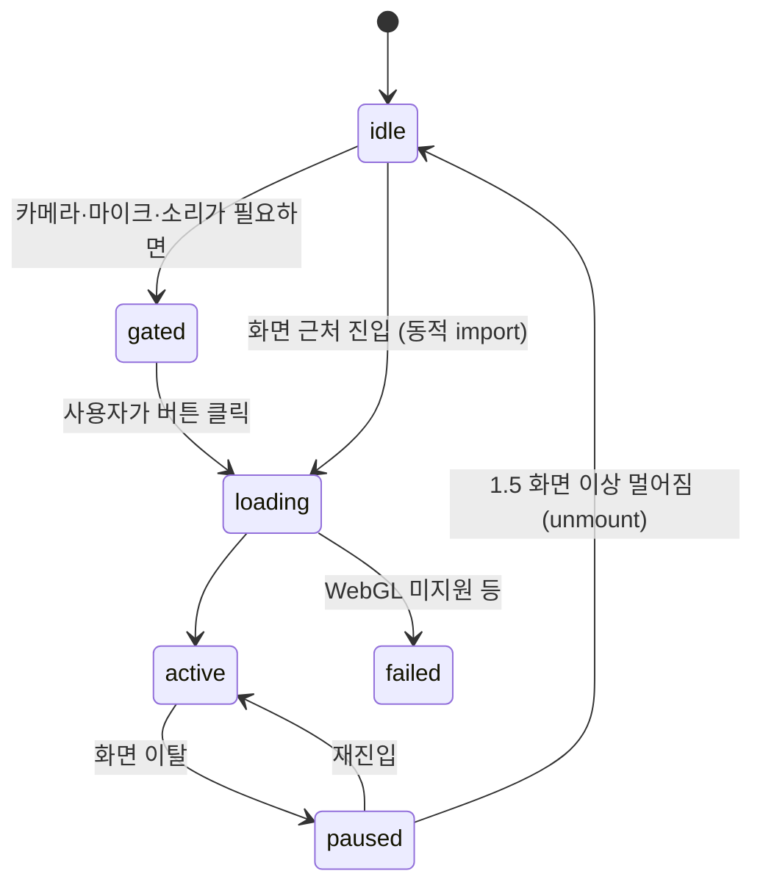

- **지연 로드** — 설명 텍스트(`meta.ts`)는 즉시 그리고, 무거운 데모 코드(`index.ts`)는 화면에 다가올 때 `import()`로 받습니다.
- **WebGL 컨텍스트 상한 3개** — 넘으면 화면에서 가장 먼 데모부터 해제합니다. 보이는 데모는 마지막까지 지킵니다.
- **경쟁 상태 방지** — 로딩 중에 스크롤로 지나쳐도 토큰으로 낡은 결과를 버리고 즉시 정리합니다.
- **한 번의 허용으로 함께 풀림** — "소리 켜기"를 한 번 누르면 같은 요구사항의 다른 데모도 같이 잠금 해제됩니다.

### 디자인 시스템

| 섹션 | 배경 | 무드 |
|---|---|---|
| Hero · Intro | `#07070a` | 묵직하고 느린 등장 |
| 01 Pointer | `#0d1240` | 쫀득한 반응 |
| 02 Scroll | `#f0f1f3` | 정제된 에디토리얼 |
| 03 Sound | `#ff5a1f` | 리듬, 펄스 |
| 04 Sensor | `#07070a` + `#c6ff3d` | 실험적, 글리치 |

배경은 고정 레이어 하나를 스크롤 위치로 보간해서 섹션 경계가 끊기지 않고 흐르듯 바뀝니다. 스크롤 연동 데모와 타임라인은 ScrollTrigger의 pin 대신 `position: sticky` + 진행도 계산으로 만들어, 데모를 동적으로 붙여도 레이아웃이 튀지 않습니다.

### 성능에서 배운 것

- 사운드 구체의 정점이 32만 개(정점마다 노이즈 6회)였을 때 오디오 섹션이 **74fps**까지 떨어졌습니다. detail을 72 → 32로 낮춰 정점을 6.5만 개로 줄이자 **120fps**(주사율 상한)로 회복했습니다.
- 화면 전체를 덮는 무거운 장면은 기기 픽셀 비율을 1.5로 제한합니다.
- 백그라운드 탭에서 돌아왔을 때 오디오 스케줄러가 밀린 노트를 한꺼번에 터뜨리지 않도록 현재 시각으로 점프합니다.

<br/>

## ✦ 로컬에서 실행

```bash
git clone https://github.com/kasangyong/interactive-media.git
cd interactive-media
npm ci
npm run dev          # http://localhost:5173
```

| 명령 | 내용 |
|---|---|
| `npm run build` | 프로덕션 빌드 (`dist/`) |
| `npm run lint` / `npm run typecheck` | ESLint / `tsc --noEmit` (`any` 금지) |
| `npm test` | 단위 테스트 (Vitest) — DemoHost 생명주기, 색 보간, 권한 처리 |
| `npm run e2e` | 데스크톱·모바일에서 페이지 끝까지 스크롤하는 스모크 테스트 (Playwright, 가짜 카메라·마이크 사용) |

> 카메라는 브라우저 정책상 **HTTPS 또는 localhost**에서만 켜집니다. `http://192.168.x.x` 같은 주소로 접속하면 차단됩니다. 다른 프로그램(Zoom, TouchDesigner 등)이 웹캠을 쓰고 있어도 켜지지 않습니다.

`main` 브랜치에 푸시하면 GitHub Actions가 lint · typecheck · 테스트 · 빌드를 거쳐 GitHub Pages로 자동 배포합니다.

<br/>

## ✦ 데모 추가하기

데모 하나는 폴더 하나입니다.

```
src/demos/my-demo/
├── meta.ts    # 제목, 설명, 사용 API, 필요 권한, 레이아웃
└── index.ts   # export function create(container): Demo
```

```ts
// src/demos/registry.ts — 한 줄 추가하면 해당 챕터에 블록이 자동으로 생깁니다
[myDemo.id]: { meta: myDemo, load: () => import('./my-demo') },
```

`requires: ['webgl']`이면 GL 상한 관리 대상이 되고, `['camera']` · `['microphone']` · `['audio-gesture']`이면 사용자가 버튼을 누르기 전까지 시작하지 않습니다.

<details>
<summary><b>프로젝트 구조</b></summary>

```
index.html                 모든 섹션 마크업
src/
├── main.ts                부트: 로더 → 스크롤 → 배경 → 커서 → 내비 → DemoHost
├── core/
│   ├── demo-host.ts       화면 위치 기반 생명주기, GL 상한, 권한 게이트
│   ├── stage.ts           캔버스 / Three.js / WebGL2 스테이지 + 리사이즈
│   ├── background.ts      섹션 컬러 보간
│   ├── audio.ts           공유 AudioContext, 룩어헤드 스케줄러
│   ├── hands.ts           MediaPipe 손 인식 로더 (GPU → CPU 폴백)
│   ├── permissions.ts     카메라·마이크·모션 권한
│   └── ...                scroll, cursor, nav, reveal, loader, glsl
├── demos/<id>/            데모 17개 (meta.ts + index.ts)
├── sections/              hero, timeline, outro
└── styles/
tests/unit/                Vitest
tests/e2e/                 Playwright 스모크
scripts/                   이미지 생성(sd-turbo), README 캡처
```

</details>

<br/>

## ✦ 크레딧

- 유체 시뮬레이션: Jos Stam의 *Stable Fluids*, 구조는 Pavel Dobryakov의 [WebGL-Fluid-Simulation](https://github.com/PavelDoGreat/WebGL-Fluid-Simulation) (MIT)을 참고해 단순화
- 3D 심플렉스 노이즈: Ashima Arts / Stefan Gustavson (MIT)
- 아스키 셰이더의 5×5 비트맵 글리프 기법: movAX13h
- 손 인식: [MediaPipe Hand Landmarker](https://ai.google.dev/edge/mediapipe/solutions/vision/hand_landmarker) (Apache 2.0)
- 라이브러리: [Three.js](https://threejs.org), [GSAP](https://gsap.com), [Lenis](https://lenis.darkroom.engineering), [simplex-noise](https://github.com/jwagner/simplex-noise.js)
- 타임라인·패럴랙스 이미지와 README 캡처용 카메라 입력은 로컬에서 **Stable Diffusion Turbo**로 생성했습니다 (실제 인물 아님, [`scripts/gen_images.py`](scripts/gen_images.py)). sd-turbo 모델 라이선스 조건을 따릅니다.
- 영감: [Lusion](https://lusion.co), 브루탈리즘 데모는 Genuary Day 23 "Inspired by brutalism" TouchDesigner 작업에서 아이디어를 얻었습니다.
